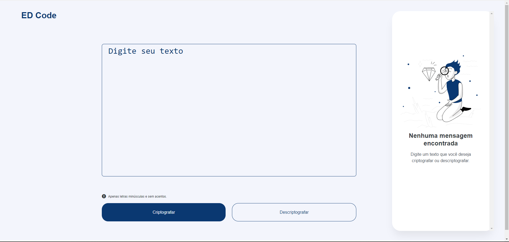

# DECODIFICADOR DE TEXTO

## Challenge ONE Iniciante em Programação: Decodificador de texto com Javascript!
<picture>
  
</picture>

### [Clique aqui para ver o decodificador!](https://ivanildoborges.github.io/decodificador-de-texto-js/)

#### Descrição:
 - Aplicação que criptografa textos, assim você poderá trocar mensagens secretas com outras pessoas que saibam o segredo da criptografia utilizada.

### Chaves de criptografia:
 - A letra "e" é convertida para "enter"
 - A letra "i" é convertida para "imes"
 - A letra "a" é convertida para "ai"
 - A letra "o" é convertida para "ober"
 - A letra "u" é convertida para "ufat"

#### Exemplo:
 - "gato" => "gaitober"
 - gaitober" => "gato"
